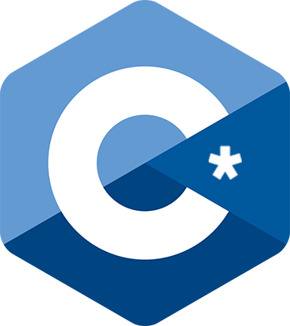

# C* Compiler




The C* compiler is a C-like language which attempts to modernize C  by improving upon the preprocessor, removing legacy features, and sprinkling in a few concepts from C++. C*'s biggest features are its new preprocessor, the module system, and minor improvements that make usage a breeze.

## Roadmap
- [X] Lexer
  - [X] Literals
  - [X] Keywords
  - [X] Punctuators
  - [X] Operators
- [X] Parser
    - [X] Function and variable recognition
    - [X] Loops
    - [X] Conditionals
    - [X] Conditional expressions
    - [X] Switch statements
    - [X] Expressions
    - [X] Statements
- [X] IR generation (partially)
- [ ] Obj generation

# Features
## New Preprocessor

The C preprocessor is by no means pretty and can be rather restrictive in certain scenarios. It has been given more flexibility, so much to the point it could be considered too powerful. It's up to the programmer to use it properly.

## Module & Header System

The inclusion of a module (and header) system will improve symbol tables internally and allow more flexibility for the programmer by not having to have both a source and a header file open. This of course requires integration of the `import` and `export` keywords, alongside `module`. Additionally, C* contains a transpiler, which turns valid C code and all C standard library functions into a valid C* module, which will make migration and usage of C code in your codebase much easier. These are differentiated from modules with the `header` keyword. This is what sets C* apart from other languages attempting to replace C.

## Legacy Keyword Elimination & New Keyword Addition

Legacy keywords such as `inline` and `register` have been removed due to modern compiler optimizations making them redundant. In addition, many keywords have been replaced by their modern counterparts, such as `auto` now providing type inference and `typedef` being entirely replaced with `using`. Namespaces have also been added solely for the purpose of better encapsulation, used through the `namespace` keyword.

## Improved Programmer Experience

In C, `NULL` is a preprocessor directive; it is not a real keyword. C* changes this by making `NULL` a keyword, used through `null`. Additionally, things such as array declarations have had their syntax shifted from `int var[5]` to `int[5]` var. `true`, `false`, and `bool` are now also keywords. The addition of such is to improve clarity and unity between varying codebases.

## Reflection

C* introduces CTTI (compile-time type information) through the use of the `reflect()` keyword, which provides lots of insight into the type of a variable. It provides the name, size, and much more to improve not only debugging, but program visualization at runtime.

# C* Program

C* is nowhere near finished, but certain things do compile into a valid Assembly file. For example, the following program will compile into an assemblable and linkable x64 Windows program:

```
export int main(byte* args) {
	
	int a = 0;
	int b = 1;
	int c = 0;
	int n = 5;
	
	while (n) {
		
		c = 0 + a + b;
		a = 0 + b;
		b = 0 + c;
		
		n--;
		
	}
	
	return 0 + c;
	
}
```

# How to Build

C* does not require a build order. Any build tool which includes all the source files will work. Requires a compiler that supports `#pragma once`.

# How to Use

Place a file named `code.csr` in the same directory as the compiled executable. It will open a terminal window for a few seconds which will print out every stage of the compilation. The compiled Assembly can be found at the very bottom after everything else.
